# 🏨 HotelReservation

Dieses Repository wird im Rahmen des Moduls **"FS25 Anwendungsentwicklung mit Python"** von Denis Vögeli verwendet. Alle
User Stories wurden ausschliesslich durch ihn umgesetzt.

---

## Inhaltsverzeichnis

- [Anleitung für das Starten der Web-Applikation](#anleitung-für-das-starten-der-web-applikation)
    - [📦 Angular Frontend](#-angular-frontend)
    - [🐍 Python Backend (FastAPI)](#-python-backend-fastapi)

- [Testen via GUI](#testen-via-gui)

- [Testen via API](#testen-via-api)

- [🚀 Wichtige Befehle](#-wichtige-befehle)
    - [Starten des Frontends](#-starten-des-frontends)
    - [Starten des Backends](#-starten-des-backends)
    - [📄 Generieren der aktuellen API-Dokumentation (OpenAPI)](#-generieren-der-aktuellen-api-dokumentation-openapi)

- [Dokumentation](#-dokumentation)
    - [🏗️ Backend Architektur](#-backend-architektur)
    - [🔄 N-Tier Architektur](#-n-tier-architektur)
    - [📁 Projektstruktur](#-projektstruktur)

- [📚 Eingesetzte Libraries](#-eingesetzte-libraries)

- [Hervorzuhebende Codeausschnitte](#hervorzuhebende-codeausschnitte)
    - [Datenbank Änderungen](#datenbank-änderungen)
    - [Login via JWT](#login-via-jwt)
    - [Varia](#ausschalten-der-cors-policy)

- [User Stories «Hotelreservierungssystem»](#user-stories-hotelreservierungssystem)
  -[Minimale User Stories](#minimale-user-stories)
    - [User Stories mit DB-Schemaänderung](#user-stories-mit-db-schemaänderung)
    - [User Stories mit Datenvisualisierung](#user-stories-mit-datenvisualisierung)
    - [Optionale User Stories](#optionale-user-stories)

---

## Anleitung für das Starten der Web-Applikation

Nachfolgende Schritte sind nötig um die Web-Applikation starten zu können.

### 📦 Angular Frontend

Im Frontend wurde das Angular Framework eingesetzt.

#### 1. Frontend klonen

Öffne die git bash und klone das Repository mittels SSH:

```bash
git clone git@github.com:AEPFS2025Group11/hotelreservation_frontend.git
```

#### 2. IDE starten

Starte eine beliebige IDE und öffne das Projekt. Bei der Umsetzung des Frontends wurde IntelliJ verwendet.

#### 3. Abhängigkeiten installieren

Stelle sicher, dass npm installiert ist (ansonsten befolge
diese [Anleitung](https://docs.npmjs.com/downloading-and-installing-node-js-and-npm)) und führe folgenden Command aus:

```bash
npm ci
```

#### 4. Frontend starten

Das Frontend kannst du mit folgendem Command starten:

```bash
ng serve --proxy-config proxy.conf.json
```

Hinweis: Um die CORS-Policy im Backend umgehen zu können wird manuell ein Proxy konfigueriert.

### 🐍 Python Backend (FastAPI)

Das Backend wurde mittels FastAPI implementiert und basiert auf der Programmiersprache Python.

#### 1. Backend klonen

Klone das Backend via git bash und SSH:

```bash
git clone git@github.com:AEPFS2025Group11/hotelreservation_frontend.git
```

#### 2. IDE starten

Starte eine beliebige IDE und öffne das Projekt. Bei der Umsetzung des Backends wurde PyCharm verwendet.

#### 3. Abhängigkeiten installieren

Installiere die notwendigen libraries und Abhängigkeiten:

```bash
pip install -r path/to/requirements.txt
```

#### 4. Backend starten

Das Backend kannst du mit folgendem Command starten:

```bash
uvicorn app.main:app --reload --host 127.0.0.1 --port 5049
```

---

## Testen via GUI

Anstelle von Deepnote wurde für das GUI ein Angular Frontend gewählt. Dieses kommuniziert via HTTP mit der
REST-Schnittstelle des Backends. Möchte man das Backend via GUI testen, müssen zuerst vorherige Schritte erledigt worden
sein.

In der Aufgabenstellung wurden zwei verschiedene Rollen identifiziert und in der User Datenbank angelegt. Diese Rollen
decken jeweils unterschiedliche User Stories ab.

### Admin

Der Admin Account wird für die Admin User Stories verwendet. Durch Login gelangt man direkt auf die exklusiven Admin
Seiten.

Diese sind:

TODO: Bild Login Admin

### User

Alle übrigen Accounts gelten als reguläre Kunden. Ein Anmelden mit einem Kundenprofil leitet den Kunden auf die
normalen, für den Kunden zugänglichen Seiten.

Diese sind:

Note: Es ist möglich ohne Anmeldung auf verschiedene Seiten (bspw. Hotel- oder Zimmersuche) zu gelangen. Will man dann
eine Buchung tätigen, muss man sich anmelden. Dieses Vorgehen benötigt jedoch das Wissen über die eingesetzten Routes.

TODO: Bild Login User

## Testen via API

Alternativ kann man die REST-Schnittstelle auch manuell mittels HTTP-Requests testen.

### Testen mit Postman

Postman eignet sich für das Testen mit HTTP-Requests.

#### Testen als Admin

Möchte man die API als ADMIN via Postman testen, muss man folgende Schritte befolgen:

1. POST Request - http://localhost:4200/api/auth/login

   body:
   {
   "email": "admin@example.com",
   "password": "asdf"
   }
2. Empfangenes Token als Bearer Token beim Authentication Tab in Postman hinterlegen.
   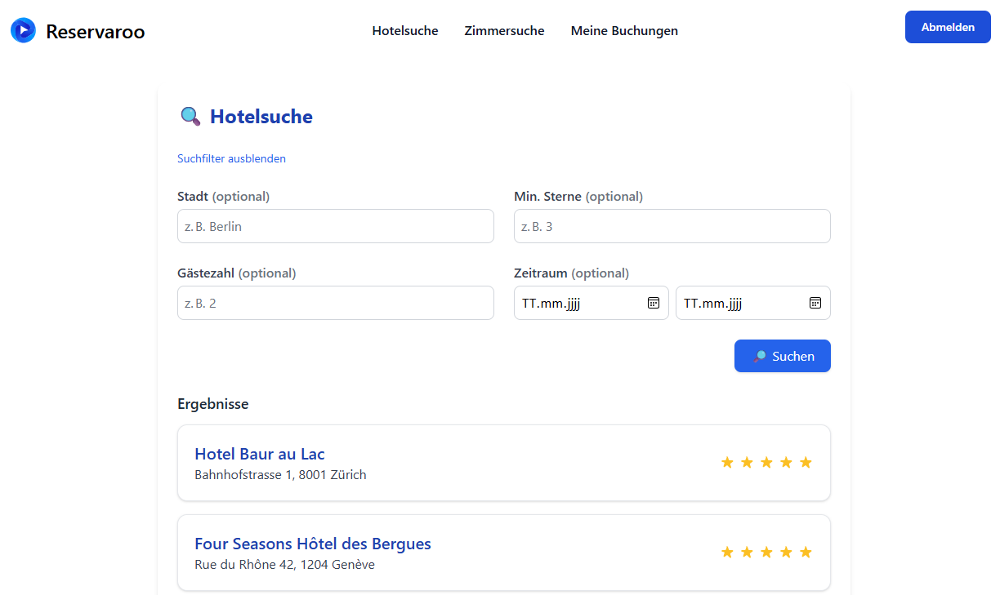

Mit dieser Einstellung können die Admin Endpoints getestet werden. Diese sind geschützt und können nur durch den Admin
angesprochen werden.

Folgende API's sind zum Teil geschützt und nur durch den Admin Account ansprechbar:

- statistics_api
- booking_api
- room_api

Hint: Die geschützen Routen sind erkennbar am '/admin' am Ende der Route.

#### Testen als User

Gleiches Vorgehen wie beim Admin User nur kann die Email mit einer beliebigen Email aus der Datenbank getauscht werden.
Das Passwort ist dasselbe.

Alternativ kann via Registrierungs-Formular ein neuer User erstellt werden.

### Credentials

| Username                 | Password | Role  |
|--------------------------|----------|-------|
| admin                    | asdf     | admin |
| any user from table user | asdf     | user  |  

Hint: Das Passwort ist in der Datenbank mit HS256 gehasht. Auf ein Salting wurde verzichtet.

---

## 🚀 Wichtige Befehle

### 🔧 Starten des Frontends

```bash
ng serve --proxy-config proxy.conf.json
```

### 🔧 Starten des Backends

```bash
uvicorn app.main:app --reload --host 127.0.0.1 --port 5049
```

### 📄 Generieren der aktuellen API-Dokumentation (OpenAPI)

Um einen Überblick über alle verfügbaren Backend-Schnittstellen zu erhalten, kann folgender Befehl ausgeführt werden:

```bash
curl http://localhost:5049/openapi.json -o openapi.json
```

Alternativ steht auch eine browserbasierte Ansicht unter [http://localhost:5049/redoc](http://localhost:5049/redoc) zur
Verfügung – vorausgesetzt, der Server läuft.

---

# 📚 Dokumentation

In diesem Kapitel werden die grundlegenden **Software- und Architekturentscheidungen** erklärt und dargestellt.

---

## 🏗️ Backend Architektur

Dieses Dokument beschreibt die Architektur des Backend-Systems, basierend auf einer N-Tier Architektur mit FastAPI,
SQLAlchemy und weiteren unterstützenden Libraries.

---

### 🔄 N-Tier Architektur

Die Anwendung ist in klar getrennte Schichten unterteilt, um Wartbarkeit, Testbarkeit und Skalierbarkeit zu
gewährleisten. Die Schichten kommunizieren jeweils von aussen nach innen und haben kein Kenntnis über vorherige
Schichten.

### 📁 Projektstruktur

```text
backend/
│
├── app/
│   ├── api/              # API-Routen (Controller)
│   ├── auth/             # Auth-Logik
│   ├── database/         # Datenbank
│   ├── entities/         # SQLAlchemy-Modelle (Entities)
│   ├── repositories/     # Datenzugriff / Repositories
│   ├── services/         # Geschäftslogik
│   │   └── models/       # Pydantic-Modelle (DTOs)
│   ├── util/             # Hilfsklassen
│   └── main.py           # FastAPI Entry Point
│
├── requirements.txt      # Python Abhängigkeiten
└── README.md             # Projektbeschreibung
```

#### 📍 API (Application Programming Interface)

- Definiert die HTTP-Endpunkte (REST).
- Handhabt eingehende Anfragen und sendet Antworten.
- Nutzt Pydantic-Modelle zur Validierung und Serialisierung.

#### ⚙️ Services

- Enthält die zentrale Geschäftslogik.
- Verarbeitet validierte Daten aus der API-Schicht.
- Ruft Methoden aus der Repository-Schicht auf.

#### 📦 DTOs (Data Transfer Objects)

- Repräsentieren strukturierte Daten, die zwischen Schichten ausgetauscht werden.
- Basieren auf Pydantic für automatische Validierung und Typsicherheit.

#### 🗃️ Repositories

- Zuständig für den Datenzugriff (CRUD-Operationen).
- Verwenden SQLAlchemy für ORM-Funktionalität.
- Trennen Persistenzlogik von der Geschäftslogik.

#### 🧬 Entities

- Datenbankmodelle, die mit Tabellenstrukturen korrespondieren.
- Definiert mithilfe von SQLAlchemy ORM.
- Enthalten Felder und optionale Relationen.

---

## 📚 Eingesetzte Libraries

| Library                                       | Beschreibung                                                     |
|-----------------------------------------------|------------------------------------------------------------------|
| [FastAPI](https://fastapi.tiangolo.com/)      | Modernes Web-Framework für schnelle APIs mit automatischer Doku. |
| [SQLAlchemy](https://www.sqlalchemy.org/)     | ORM für die objektorientierte Datenbankmodellierung.             |
| [Pydantic](https://docs.pydantic.dev/latest/) | Validierung und Serialisierung von Daten mit Python-Typen.       |
| [Uvicorn](https://www.uvicorn.org/)           | Leichtgewichtiger ASGI-Server für asynchrone Webanwendungen.     |

---

# Hervorzuhebende Codeausschnitte

## Datenbank Änderungen

Für die Umsetzung gewisser User Stories mussten Tabellen erstellt oder ergänzt werden.

### Hinzugefügte Entitäten

Überblick über die neu erstellten Tabellen.

#### Review

Tabelle Review wurde für die Hotel Bewertungen erstellt.

````sql
CREATE TABLE review
(
    id         INTEGER PRIMARY KEY AUTOINCREMENT,
    booking_id INTEGER NOT NULL,
    created_at DATE    NOT NULL,
    rating     INTEGER NOT NULL CHECK (rating BETWEEN 1 AND 5),
    comment    TEXT,

    FOREIGN KEY (booking_id) REFERENCES booking (id) ON DELETE CASCADE
);
````

#### Payment

Tabelle Payment wurde für die Zahlungen erstellt.

````sql
CREATE TABLE payment
(
    id         INTEGER PRIMARY KEY AUTOINCREMENT,
    booking_id INTEGER NOT NULL,
    method     TEXT    NOT NULL,
    status     TEXT    NOT NULL DEFAULT 'pending',
    paid_at    DATE,
    amount     FLOAT   NOT NULL,
    invoice_id INTEGER NOT NULL,
    FOREIGN KEY (booking_id) REFERENCES booking (id) ON DELETE CASCADE,
    FOREIGN KEY (invoice_id) REFERENCES invoice (id) ON DELETE CASCADE
);
````

### Angepasste Enitäten

Überblick über die angepassten Tabellen.

#### Address

Latitude und longitude wurden für die Karte hinzugefügt.

````sql
CREATE TABLE address
(
    id        INTEGER PRIMARY KEY,
    street    TEXT  NOT NULL,
    city      TEXT  NOT NULL,
    zip_code  TEXT,
    latitude  FLOAT NOT NULL,
    longitude FLOAT NOT NULL
);
````

#### Invoice

Status wurde ergänzt

````sql
CREATE TABLE invoice
(
    id           INTEGER PRIMARY KEY,
    booking_id   INTEGER NOT NULL,
    issue_date   DATE    NOT NULL DEFAULT CURRENT_TIMESTAMP,
    total_amount REAL    NOT NULL,
    status       TEXT    NOT NULL,
    FOREIGN KEY (booking_id) REFERENCES booking (id) ON DELETE CASCADE
);
````

#### User

Guest wurde zu User umbenannt.

Folgende Attribute wurden ergänzt:

- hashed_password
- role
- is_active
- phone_number
- birth_date
- nationality
- gender
- loyalty_points
- created_at
- updated_at

````sql
CREATE TABLE user
(
    id              INTEGER PRIMARY KEY,
    first_name      TEXT    NOT NULL,
    last_name       TEXT    NOT NULL,
    email           TEXT    NOT NULL UNIQUE,
    hashed_password TEXT    NOT NULL,
    role            TEXT    NOT NULL,
    is_active       BOOLEAN NOT NULL,
    phone_number    TEXT,
    birth_date      DATE,
    nationality     TEXT,
    gender          TEXT,
    loyalty_points  INTEGER,
    created_at      DATE    NOT NULL,
    updated_at      DATE    NOT NULL,
    address_id      INTEGER,
    FOREIGN KEY (address_id) REFERENCES address (id) ON DELETE SET NULL
);
````

### Anpassung der INSERT-Statements

Um unnötige Redundanz zu vermeiden wurde darauf verzichtet die Anpassungen der INSERT-Statements in dieser Dokumentation
zu ergänzen. Bitte schaue im nachfolgenden SQL-Skript welches sich in diesem Projekt befindet selbstständig nach.

app/database/Hotel_Reservation_Sample_Script.sql

### Einsatz von Fremdschlüssel Beziehungen in SQLite

Um sicherzustellen, dass die Fremdschlüssel Beziehungen funktionieren, mussten diese explizit aktiviert werden.

app/main.py

````python
    @event.listens_for(Engine, "connect")


def enforce_foreign_keys(dbapi_connection, connection_record):
    cursor = dbapi_connection.cursor()
    cursor.execute("PRAGMA foreign_keys=ON")
    cursor.close()
````

## Login via JWT

Das Login erfolgt über JWT (JSON Web Tokens) Standard.

### Passwort Hashing

Die Funktion hash_password nimmt ein Klartext-Passwort entgegen und gibt einen sicheren Hash davon zurück.

app/util/password.py

````python
    from passlib.context import CryptContext

pwd_context = CryptContext(schemes=["bcrypt"], deprecated="auto")


def hash_password(password: str) -> str:
    return pwd_context.hash(password)


def verify_password(plain_password: str, hashed_password: str) -> bool:
    return pwd_context.verify(plain_password, hashed_password)
````

### Ausstellen des JWT Tokens

Create_access_token erstellt das für die Anmeldung notwendige JWT Token.

app/util/jwt.py

````python
    from datetime import datetime, timedelta

from jose import jwt, JWTError

SECRET_KEY = "supersecretkey"
ALGORITHM = "HS256"


def create_access_token(user_id: int, role: str, expires_delta=timedelta(hours=1)):
    to_encode = {
        "sub": str(user_id),
        "role": role,
        "exp": datetime.now() + expires_delta
    }
    return jwt.encode(to_encode, SECRET_KEY, algorithm=ALGORITHM)


def decode_token(token: str):
    try:
        return jwt.decode(token, SECRET_KEY, algorithms=[ALGORITHM])
    except JWTError:
        return None
````

### Admin Rolle prüfen

Um Endpoints zu schützen und explizit für den Admin User freizugeben, wurde folgender Code erstellt.

app/auth/dependencies.py

````python
    from fastapi import Depends, HTTPException
from fastapi.security import OAuth2PasswordBearer

from app.util.enums import Role
from app.util.jwt import decode_token

oauth2_scheme = OAuth2PasswordBearer(tokenUrl="/api/auth/login")


def get_current_user_role(token: str = Depends(oauth2_scheme)) -> str:
    payload = decode_token(token)
    if not payload:
        raise HTTPException(status_code=401, detail="Ungültiges token.")
    return payload["role"]


def admin_only(role: str = Depends(get_current_user_role)):
    if role != Role.ADMIN:
        raise HTTPException(status_code=403, detail="Admin Rechte benötigt.")

````

## Varia

Im Kapitel Varia, werden Codeausschnitte aufgezeigt, welche spannend sein könnten, jedoch nicht eindeutig einer User
Story oder direkt für das Projekt relevant waren.

### Ausschalten der CORS Policy

app/main.

````python
    app.add_middleware(
    CORSMiddleware,
    allow_origins=origins,
    allow_credentials=True,
    allow_methods=["*"],
    allow_headers=["*"],
)
````

# User Stories «Hotelreservierungssystem»

Nachfolgend alle umgesetzten User Stories und die Referenzen auf den entsprechenden Source Code.

## Minimale User Stories

Dieser Abschnitt enthält eine Liste von minimalen und optionalen User Stories, die im
Rahmen dieser Projektarbeit implementiert werden sollten.

> **_NOTE:_**  Es wurden alle User Stories umgesetzt.

### US1:

http://localhost:5049/api/hotels/

Verwendete Methode des Hotel API Controllers:

- get_hotels()

Mit folgenden Query Params können die Hotels gefiltert werden:

- city: Optional[str] = None
- min_stars: Optional[int] = None
- capacity: Optional[int] = None
- check_in: Optional[date] = None
- check_out: Optional[date] = None

Ansicht im GUI:
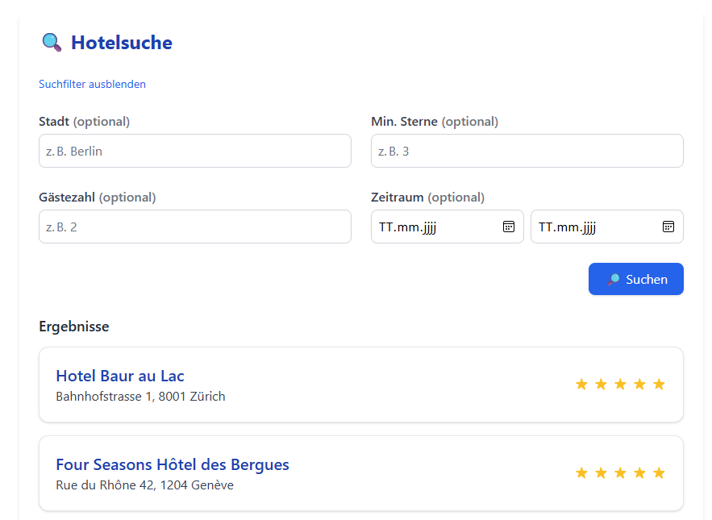

### US2:

http://localhost:5049/api/rooms/

Verwendete Methode des Room API Controllers:

- get_rooms()

Mit folgenden Query Params können die Zimmer gefiltert werden:

- city: Optional[str] = None
- capacity: Optional[int] = None
- check_in: Optional[date] = None
- check_out: Optional[date] = None

Ansicht im GUI:
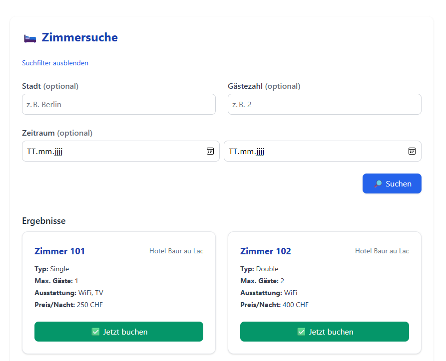

### US3:

http://localhost:5049/api/hotels/

Verwendete Methode:

- create_hotel()
- update_hotel()
- delete_hotel()

### US4:

http://localhost:5049/api/bookings/

Verwendete Methode:

- create_booking()

Folgendermassen muss eine Buchungsanfrage aus dem Frontend aussehen.

````python
    class BookingIn(BaseModel):


user_id: int
room_id: int
check_in: date
check_out: date
is_cancelled: bool = False
total_amount: float

model_config = {'from_attributes': True}
````

### US5:

http://localhost:5049/api/bookings/

Verwendete Methode:

- create_booking()

In nachfolgendem Codeausschnitt ist ersichtlich, dass die Rechnung beim Erstellen einer Buchung erstellt wird.

````python
    def create(self, booking: BookingIn) -> BookingOut:


self._ensure_availability(booking)
user = self._get_user(booking)
room = self._get_room(booking)
hotel = self._get_hotel(room.hotel_id)
booking = Booking(**booking.model_dump())
saved_booking = self.booking_repo.create(booking)
if not saved_booking:
    raise HTTPException(status_code=500, detail="Booking konnte nicht erstellt werden.")
self._generate_invoice(booking=saved_booking)
self._award_loyalty_points(saved_booking)
logger.info(f"Booking {saved_booking.id} created and invoice generated")
try:
    send_booking_confirmation(
        to_email=user.email,
        guest_name=user.first_name,
        hotel_name=hotel.name,
        booking_id=saved_booking.id,
        check_in=saved_booking.check_in,
        check_out=saved_booking.check_out,
        room_type=room.type.description,
    )
except Exception as e:
    logger.warning(f"Fehler beim Senden der Buchungsbestätigung: {e}")
return BookingOut.model_validate(saved_booking)
````

### US6:

http://localhost:5049/api/bookings/

Verwendete Methode:

- cancel_booking()

In diesem Codeausschnitt ist ebenfalls ersichtlich, dass eine Rechnung ebenfalls storniert wird, falls eine Buchung
gecancelt wird:

````python
    if booking.invoice:
    invoice = self.invoice_repo.get_by_booking_id(booking.id)
if not invoice:
    logger.error(f"Invoice not found for booking {booking.id}")
else:
    invoice.total_amount = 0
    invoice.status = InvoiceStatus.CANCELLED
    self.invoice_repo.update(invoice)
````

### US7:

Der Preis wird an verschiedenen Orten dynamisch berechnet. Dies wird dem Benutzer aber nicht gezeigt und ist nur durch
den Code im Backend ersichtlich. In den Hochsaison Monaten (7,8,9) steigen die Preise bis um den Faktor 1.2. Im Winter
wiederum sinken die Preise um Faktor 0.8

Pfad zur ausgelagerten Hilfsmethode für das Berechnen des dynamischen Preises:

app/util/dynamic_pricing.py

### US8:

http://localhost:5049/api/bookings/

Verwendete Methode:

- get_bookings()

Hint: Das GET Command auf die base url dieses Controllers ist ausschliesslich dem Admin user vorbehalten.

Ansicht im GUI:
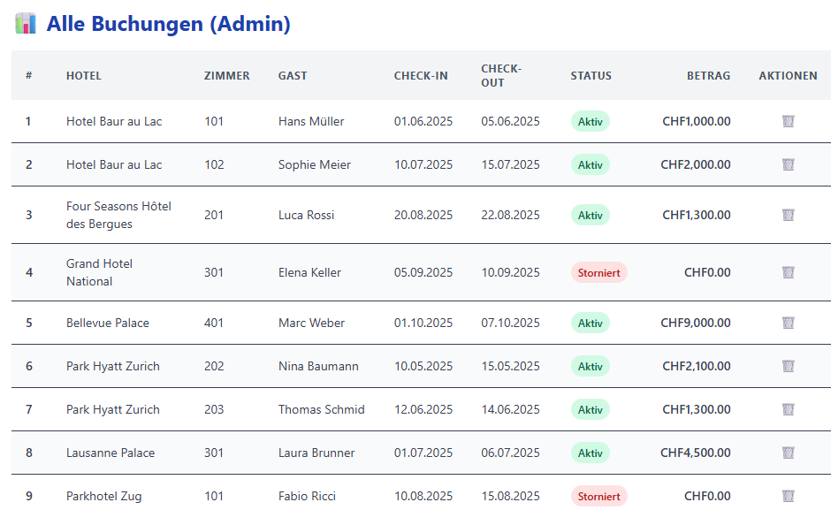

### US9:

http://localhost:5049/api/rooms/admin/

Verwendete Methode:

- get_rooms()

Ansicht im GUI:
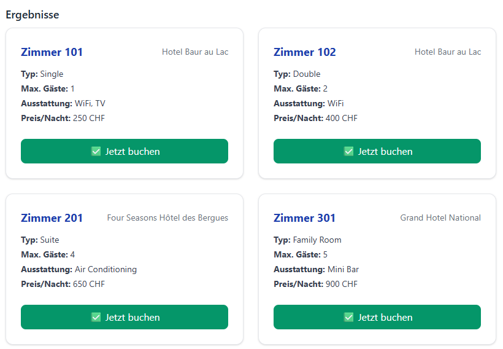

### US10:

http://localhost:5049/api/rooms/admin/

Verwendete Methode:

- create_room()
- update_room()
- delete_room()
- update_price() PATCH

Ansicht im GUI:
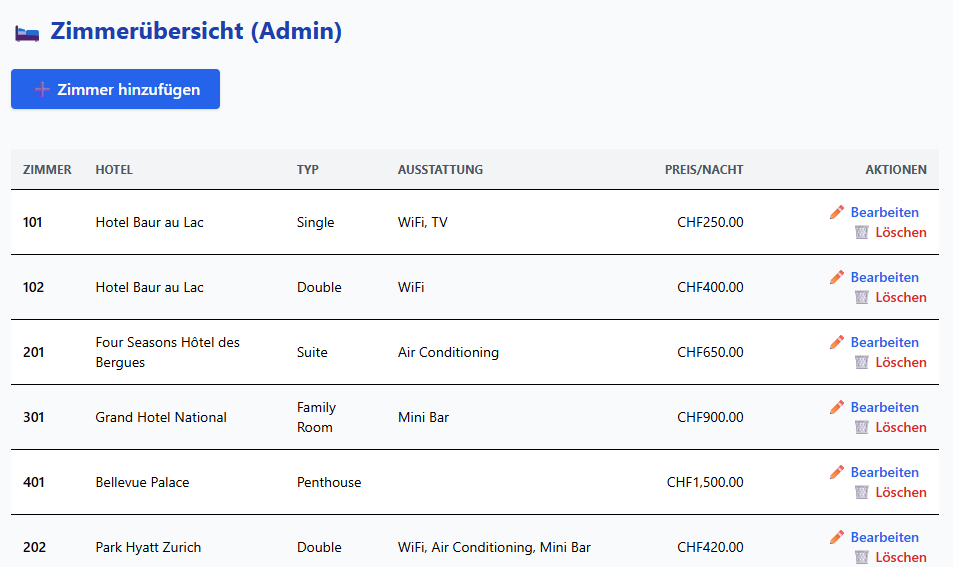

## User Stories mit DB-Schemaänderung

Die folgenden User Stories erfordern eine Änderung des Datenbankschemas, z.B. das
Hinzufügen neuer Tabellen, die Definition neuer Beziehungen und die Generierung
neuer Daten. Implementiert **mindestens zwei** der folgenden User Stories oder fügt
eure eigenen User Stories hinzu, so dass ihr mindestens eine neue Tabelle, eine
entsprechende Beziehung und Daten hinzufügen müsst.

> **_NOTE:_**  Es wurden alle User Stories umgesetzt.

### US1:

http://localhost:5049/api/bookings/

Verwendete Methode:

- create_booking()
- update_booking()
- delete_booking()

Ansicht in GUI:
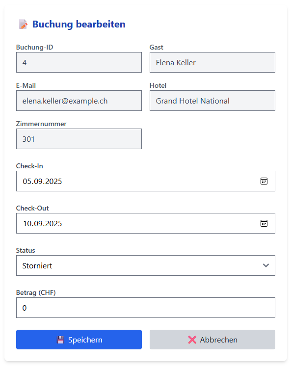

Hint: Um auf die Bearbeitungs Ansicht zu gelangen, muss man auf einen Eintrag in der Buchungsübersicht klicken.

### US2:

http://localhost:5049/api/users/4/bookings

Verwendete Methode:

- get_bookings_by_user()

Ansicht im GUI:
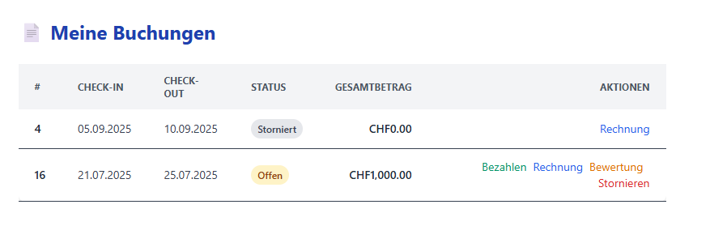

### US3:

http://localhost:5049/api/reviews/

Verwendete Methode:

- add_review()
- get_review_by_id()
- get_review_by_booking_id()
- update_review()
- delete_review()

Ansicht im GUI:
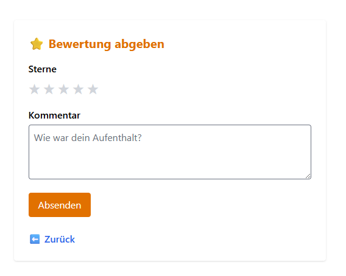

### US4:

http://localhost:5049/api/reviews/

Verwendete Methode:

- get_reviews_by_hotel_id()

Ansicht im GUI:
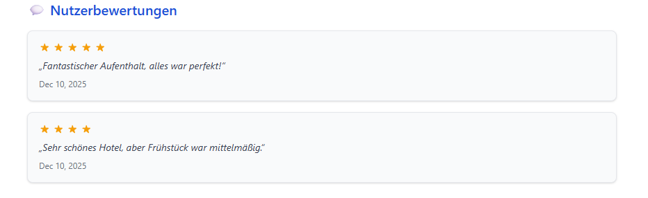

Hint: Bei einem Hotel findet man die Kundenbewertungen ganz unten.

### US5:

http://localhost:5049/api/bookings/

Verwendete Methode:

- create_booking()

````python
    def _award_loyalty_points(self, booking: Booking):
    user_id = booking.user_id
    recent_bookings = (
        self.booking_repo.db.query(Booking)
        .filter(
            Booking.user_id == user_id,
            Booking.is_cancelled == False,
            Booking.check_out <= date.today(),
            Booking.check_out >= date.today() - timedelta(days=DAYS)
        )
        .count()
    )

    if recent_bookings >= AMOUNT_RECENT_BOOKINGS:
        user = self.booking_repo.db.query(User).get(user_id)
        user.loyalty_points += LOYALTY_POINTS
        self.booking_repo.db.commit()
        logger.info(f"Awarded loyalty points to user ID {user_id}")
````

### US6:

http://localhost:5049/api/payment/

Verwendete Methode:

- create_payment()

Ansicht im GUI:

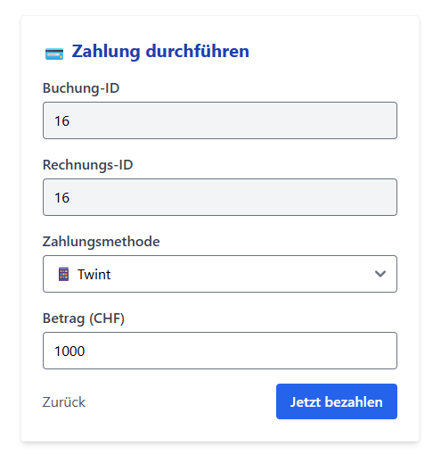

## User Stories mit Datenvisualisierung

In den folgenden User Stories geht es um die Visualisierung von Daten mit dem
Deepnote-Block «Charts» (https://deepnote.com/docs/chart-blocks). Man muss die
Ergebnisse einer SQL-Abfrage in einem «Dataframe» speichern und eine geeignete
Visualisierung auswählen. Wählt eine der folgenden User Stories oder definiert eine
eigene User Story, in der ihr Daten mit dem «Charts»-Block visualisieren könnt. Ihr
könnt euch an einer einfachen Anleitung orientieren, um die passende Visualisierung zu
wählen, z.B. https://www.atlassian.com/data/charts/how-to-choose-pie-chart-vs-bar
chart .

> **_NOTE:_**  Es wurden alle User Stories umgesetzt.

### US1:

http://localhost:5049/api/statistics/occupancy-by-room-type/

Verwendete Methode:

- occupancy_by_room_type()

Ansicht im GUI:

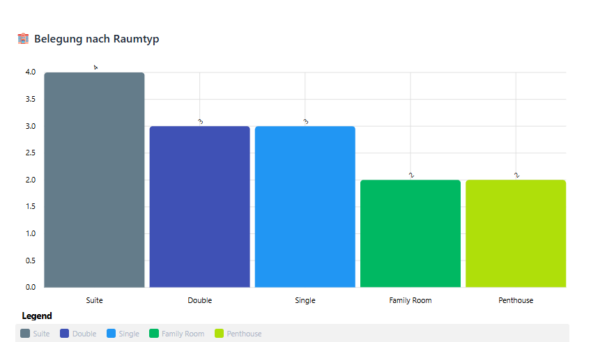

### US2:

http://localhost:5049/api/statistics/demographics/

Verwendete Methode:

- get_demographics()

Ansicht im GUI:

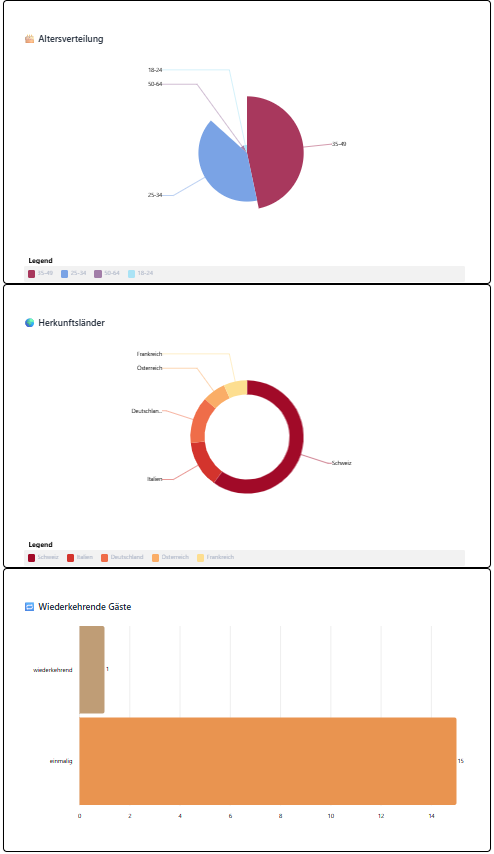

## Optionale User Stories

Die Umsetzung der folgenden User Stories erfordert zusätzliche Untersuchungen oder
Selbststudium, z. B. Dateiverarbeitung, Bibliotheksintegration oder andere
fortgeschrittene Konzepte. Wenn Ihr Euch selbst herausfordern wollt, wählt aus diesen
User Stories, aber erst nachdem Ihr die minimalen User Stories implementiert habt!

> **_NOTE:_**  Es wurden US3 und US4 umgesetzt.

### US3:

http://localhost:5049/api/nearby-places/

Verwendete Methode:

- get_nearby_places()

Ansicht im GUI:

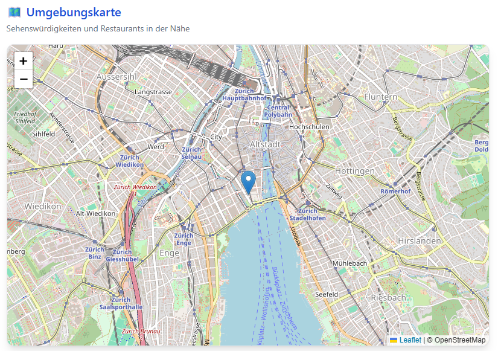

### US4:

Pfad zur Methode für die Erstellung einer Buchungsbestätigung:

app/util/booking_confirmation.py


